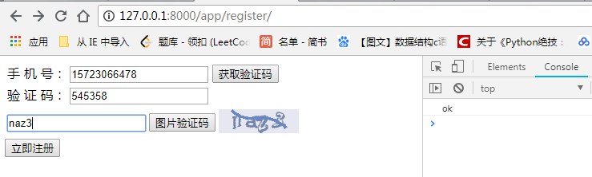
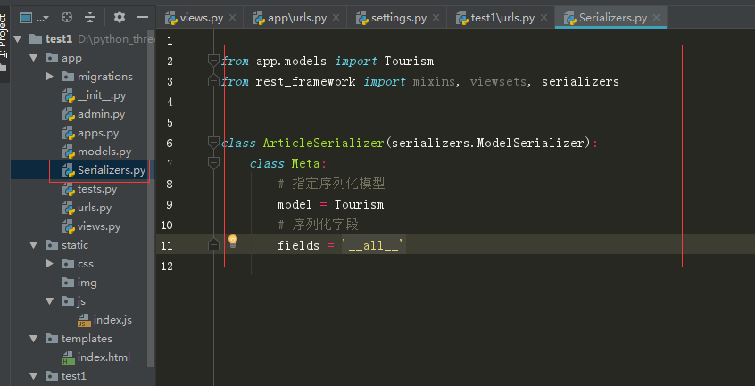

# Django-Flask
后端项目

### [短信验证和图片验证码](#1)

### [whoosh全文检索](#2)

### [token身份验证](#3)

###[使用DRF实现前后分离](#4)


---------------

-----------------


# <a id="1">短信验证和图片验证码</a>

**使用Django搭建后端实现简单的注册验证**

**实现的功能点**

* 接入螺丝帽短信平台实现了短信认证，并使用Celery进行异步化处理
* 设计4位数的随机字母加数字图形验证码用于注册验证
* 使用redis存储验证码
* 使用前后分离模式，前端通过ajax发请求

**效果图**




**通过接入螺丝帽短信平台进行短信验证**

**登录螺丝帽网站获取API接口**


----

# <a id="2">whoosh全文检索</a>

#### 使用whoosh实现一个简单的全文检索，在浏览器中实现通过关键字实现对新闻的检索

效果预览 

----

**搜索有结果的情况**


----

**搜索不到结果的情况**


* 首先通过爬虫从百度新闻获取一些数据
* 创建好MySQL数据库
* 通过Django搭建平台


**1.创建MySQL数据库**

这里笔者直接在阿里云进行操作

```
mysql> create database whosh default charset utf8;
Query OK, 1 row affected (0.09 sec)

mysql> create table news (
    -> id int,
    -> title varchar(1028),
    -> content TEXT,
    -> primary key(id)
    -> );
ERROR 1046 (3D000): No database selected
mysql> use whosh;
Database changed
mysql> create table news ( id int, title varchar(1028), content TEXT, primary key(id) );
Query OK, 0 rows affected (0.05 sec)

mysql> 
```

**2.从百度获取数据并使用Xpath解析：**


---


**新建mysqldb.py文件封装操作MySQL的方法**

```
import pymysql

def get_con():
	host = '47.106.211.81'
	port = 3308
	user = 'root'
	password = 'your password'
	database = 'whosh'
	db = pymysql.connect(host=host,user=user,password=password,database=database,charset='utf8',port=port)
	return db

def insert(db,cursor,item):
	cursor.execute(query='insert into news(title,content) values (%s,%s)',args=(item['title'],item['content']))
	# print(db)
	db.commit()

def close(db):

	db.close()
```

**新建get_news.py文件用来获取和保存数据**

```

import requests
from lxml import etree
from mysqldb import *

db = get_con()
cursor = db.cursor()


def parse_content(url):
	"""解析内容"""
	res = requests.get(url)
	if res.status_code==200:
		html = res.content.decode('utf-8')
		print(html)
		con = etree.HTML(html)
		content_list = con.xpath('//div[@class="article-content"]//span[@class="bjh-p"]//text()')
		content = ''
		for value in content_list:
			content += value.strip('')
		return content


def get():
    """获取新闻"""
    
    url = 'http://news.baidu.com/'
    res = requests.get(url)
    if res.status_code==200:
        html = res.content.decode('utf-8')
        con = etree.HTML(html)
        results = con.xpath('//div[@id="pane-news"]//ul[@class="ulist focuslistnews"]')
    for result in results:
        lis = result.xpath('.//a')
        for li in lis:
        	item = {}
        	title = li.xpath('./text()')[0]
        	href = li.xpath('./@href')[0]
        	content = parse_content(href)
        	item['title'] = title
        	item['content'] = content
        	insert(db,cursor,item)

if __name__ == '__main__':
		get()
```


**5.新建一个Django项目**


* 主要是编写视图函数和前端页面，这里就只介绍这两部分

---


**6.视图函数编写**

```
from django.shortcuts import render
from whoosh.qparser import QueryParser
from whoosh.index import create_in
from whoosh.index import open_dir
from whoosh.fields import TEXT, ID, Schema
from jieba.analyse import ChineseAnalyzer
from app.models import News

def index_create(request):
	"""索引创建"""
	
    analyser = ChineseAnalyzer()  # 导入中文分词工具
    """
    使用whoosh首先要建立schema对象，第一次创建索引时，必须定义索引的模式。该模式列出了索引中的字段。
    字段是索引中每个文档的一条信息，例如其标题或文本内容。
    下面使用到的schema索引对象。
    whoosh.fields.ID:这种类型只是将字段的整个值索引（并可选地存储）为一个单元（也就是说，它不会将其分解为单个单词）。这对于文件路径，URL，日期，类别等字段很有用。
    
    whoosh.fields.STORED:此字段与文档一起存储，但未编入索引。此字段类型未编入索引且无法搜索。
                         这对于要在搜索结果中向用户显示的文档信息很有用。
                         
    whoosh.fields.TEXT:此类型用于正文。它索引（并可选地存储）文本并存储术语位置以允许短语搜索。
    """
    schema = Schema(title=TEXT(stored=True, analyzer=analyser),
                    content=TEXT(analyzer=analyser))  # 创建索引结构

    ix = create_in("index", schema=schema, indexname='index')  # test为索引创建的地址，indexname为索引名称
    writer = ix.writer()
    # 读取文件内容
    datas = News.objects.all()
    for data in datas:
        news_title = data.title
        news_content = data.content
        writer.add_document(title=news_title,content=news_content)
    writer.commit()

def index(request):
	"""搜索"""
	
    if request.method == "GET":
        return render(request, 'index.html')

    if request.method == "POST":
        data = request.POST.get('sea')
        if data:
            new_dict = [] # 存储检索结果
            code = ''
            index = open_dir("index", indexname='index')  # 读取建立好的索引
            with index.searcher() as searcher:
                parser = QueryParser("content", index.schema)  # 生成查询字段的对象
                find = input("请输入检索内容：")  # find表示要查询的内容
                myquery = parser.parse(find)  # 在content字段查询
                
                results = searcher.search(myquery) # 搜索结果
                for result1 in results:
                    code = 200
                    new_dict.append(dict(result1))
                if not new_dict:
                    code = 100
            return render(request,'index.html',{'content': new_dict})
```

**7.前端页面实现**


```
<!DOCTYPE html>
<html lang="en">
<head>
    <meta charset="UTF-8">
    <title>whoosh</title>
</head>
<body>
    <form action='' method="post">
        
        <div class='form1'>
            <span class='search'></span>
            <input  class='inpu1'name="sea" type='text' placeholder='请输入..'/>
            <input class='bu1' value='搜索' type='submit'/>
        </div>
        
            
            <li>{{i.title}}</li>
            
        
            <li>None</li>
        
    </form>
</body>
</html>
```

**8.效果**


---------------

-----------

# <a id="3">token身份验证</a>

**使用基于 token 的身份验证的大概的流程**

1. 客户端使用用户名跟密码请求登录
2. 服务端收到请求，去验证用户名与密码
3. 验证成功后，服务端会签发一个 Token，再把这个 Token 发送给客户端
4. 客户端收到 Token 以后把它存储起来
5. 客户端每次向服务端请求资源的时候需要带着服务端签发的 Token
6. 服务端收到请求，然后去验证客户端请求里面带着的 Token，如果验证成功，就向客户端返回请求的数据


**本项目就来实现token验证，这里笔者简陋的搭了个页面来实现**

**效果预览**

1.通过网站127.0.0.1:8000/user/login/进入登录页面


2.打开127.0.0.1:8000/user/test/网址

已经登录过的用户访问会显示“恭喜无需登录直接进入”


没有登录的用户后者清空了cookie会显示“请登录“


* **使用Django的ORM框架操作数据库** 

* **这里笔者没有做注册界面，通过pycharm在shell中进行交互式调试手动注册一个账号**

* **前后端分离设计**

  

**1.模型建立**

```
class User(models.Model):
    username = models.CharField(unique=True,max_length=30)
    password = models.CharField(max_length=20)
    lastlogin = models.DateField(null=True,blank=True)

    class Meta:
        db_table = 'tb_myuser'

class UserToken(models.Model):
    """用户令牌"""
    token = models.CharField(max_length=32)
    user = models.OneToOneField('User', on_delete=models.CASCADE)
    class Meta:
        db_table = 'tb_token'
        
"""
on_delete=None,               # 删除关联表中的数据时,当前表与其关联的field的行为

on_delete=models.CASCADE,     # 删除关联数据,与之关联也删除

on_delete=models.DO_NOTHING,  # 删除关联数据,什么也不做

on_delete=models.PROTECT,     # 删除关联数据,引发错误ProtectedError

on_delete=models.SET_NULL,    # 删除关联数据,与之关联的值设置为null（前提FK字段需要设置为可空,一对一同理）

on_delete=models.SET_DEFAULT, # 删除关联数据,与之关联的值设置为默认值（前提FK字段需要设置默认值,一对一同理）

on_delete=models.SET,         # 删除关联数据,

 a. 与之关联的值设置为指定值,设置：models.SET(值)

"""
```

```

(djenv6) D:\python_three\workspace\django1\use_token>python manage.py  makemigrations
Migrations for 'user':
  user\migrations\0001_initial.py
    - Create model User
    - Create model UserToken

```

```
(djenv6) D:\python_three\workspace\django1\use_token>python manage.py  migrate
Operations to perform:
  Apply all migrations: admin, auth, contenttypes, sessions, user
Running migrations:
  Applying contenttypes.0001_initial... OK
  Applying auth.0001_initial... OK
  Applying admin.0001_initial... OK
  Applying admin.0002_logentry_remove_auto_add... OK
  Applying admin.0003_logentry_add_action_flag_choices... OK
  Applying contenttypes.0002_remove_content_type_name... OK
  Applying auth.0002_alter_permission_name_max_length... OK
  Applying auth.0003_alter_user_email_max_length... OK
  Applying auth.0004_alter_user_username_opts... OK
  Applying auth.0005_alter_user_last_login_null... OK
  Applying auth.0006_require_contenttypes_0002... OK
  Applying auth.0007_alter_validators_add_error_messages... OK
  Applying auth.0008_alter_user_username_max_length... OK
  Applying auth.0009_alter_user_last_name_max_length... OK
  Applying sessions.0001_initial... OK
  Applying user.0001_initial... OK

```


**2.手动创建一个用户**

```
(djenv6) D:\python_three\workspace\django1\use_token>python manage.py shell

Python 3.6.4 (v3.6.4:d48eceb, Dec 19 2017, 06:04:45) [MSC v.1900 32 bit (Intel)] on win32

Type "help", "copyright", "credits" or "license" for more information.

(InteractiveConsole)

>>> from user.tests import my_md5_hex
>>> from user.models import User, UserToken
>>> username = 'jun';password = my_md5_hex('123456')
>>> User.objects.create(username=username, password=password)
>>><User: User object (1)>


mysql> select * from tb_myuser;
+----+----------+----------------------------------+-----------+
| id | username | password                         | lastlogin |
+----+----------+----------------------------------+-----------+
|  1 | jun      | e10adc3949ba59abbe56e057f20f883e | NULL      |
+----+----------+----------------------------------+-----------+
1 row in set (0.00 sec)
```


**3.视图函数**

```
def login(request):
    if request.method == "GET":
        return render(request, 'index.html')
    if request.method == "POST":
        status = {'code':100, 'message':'登陆成功'}
        username = request.POST['username']
        password = request.POST['password']
        password = my_md5_hex(password)
        user = User.objects.filter(username=username, password=password).first()
        if user:
            status['userid'] = request.session['userid'] = user.id
            with transaction.atomic():
                status['token'] = token = uuid1().hex
                UserToken.objects.update_or_create(user=user, defaults={'token': token})
                current_time = timezone.now()
                if user.lastlogin:
                    delta = current_time - user.lastlogin
                    if delta.days >= 1:
                        user.point += 5
                        user.lastlogin = current_time
                        user.save()
                else:
                    user.lastlogin = current_time
                    user.save()
        else:
            status['code'] = '30001'
            status['message'] = '用户名或密码错误'
        return JsonResponse(status)


def test(request):
    print(request.session["userid"])
    return render(request,"test.html")


def userToken(request):
    """token验证"""
    id = request.session['userid']
    accept_token = request.META.get("HTTP_AUTHORIZATION")
    token=UserToken.objects.filter(user=id).first().token
    if token == accept_token:
        return JsonResponse({"msg":"恭喜无需登陆直接进入"})
    return JsonResponse({"msg":"请登陆！！！"})
```


**4.前端实现**

```
<form id="login">
    
            <tr>
                    <input type="text" class="name" name="username">
            </tr>
           <tr>
                    <input type="text" class="pw" name="password">
            </tr>
    <input type="submit" id="form-login" value="登陆">
</form>
<script>
$(document).ready(function() {
      $("#login").submit(function(e){
        e.preventDefault();
        var name = $(".name").val();
        var pw = $(".pw").val();
        $.ajax({
            url:'/user/login/',
            type:'POST',
            dataType:'JSON',
            data:{'username':name,'password':pw,csrfmiddlewaretoken:'{{ csrf_token }}'},
            success:function(data){
                if(data.code == 100)
                {console.log('OK');
                localStorage["mytest"]=data.token;
                location = "/user/test/";
                }
            },
            error:function(data){
                console.log('错误！')
            }
        })
})
    });
</script>


<script>
$(document).ready(function() {
    var token = localStorage["mytest"];
    console.log(token);
    $.ajax({
    type: "GET",
    url: "/user/userToken/",
    dataType:'JSON',
    headers: {'Authorization': token},
    success: function(data){
        $("#main").text(data.msg);
    }
});
});
</script>
```


------

---


# <a id="4">使用DRF实现前后分离</a>


**RESTFul架构： 如果一个架构符合REST原则，就称它为RESTful架构**

引用阮一峰对于RESTful架构 的解释：

```
综合上面的解释，我们总结一下什么是RESTful架构：

　　（1）每一个URI代表一种资源；

　　（2）客户端和服务器之间，传递这种资源的某种表现层；

　　（3）客户端通过四个HTTP动词，对服务器端资源进行操作，实现"表现层状态转化"。
```

**Django REST framework（DRF）**

```
Django REST framework 框架是一个用于构建Web API 的强大而又灵活的工具。

DRF框架是建立在Django框架基础之上，由Tom Christie大牛二次开发的开源项目。

特点:

提供了定义序列化器Serializer的方法，可以快速根据 Django ORM 或者其它库自动序列化/反序列化；
提供了丰富的类视图、Mixin扩展类，简化视图的编写；
丰富的定制层级：函数视图、类视图、视图集合到自动生成 API，满足各种需要；
多种身份认证和权限认证方式的支持；
内置了限流系统

```


**这里笔者使用docker运行Mysql，这里笔者已经创建好了数据库并加入了数据**

```
docker pull mysql

[root@izwz9a76txemsigen8x3hoz ~]# docker run -d -p 3308:3306 -v /root/mysql/slave-1/conf:/etc/mysql/mysql.conf.d -v /root/mysql/slave-1/data:/var/lib/mysql --name mysql-docker -e MYSQL_ROOT_PASSWORD=123456 mysql:5.7
609320b8e0ea8815194634afd7ce330f8204eb409509f17bc65cdfe12aa75548

[root@izwz9a76txemsigen8x3hoz ~]# docker exec -it mysql-docker /bin/bash
root@08d124c70da7:/# mysql -u root -p
Enter password: 
Welcome to the MySQL monitor.  Commands end with ; or \g.

```


**新建Django项目，反向生成模型**

```
(djenv6) D:\python_three\workspace\django1\test1>python manage.py inspectdb > app/models.py
```

**安装djangorestframework**

```
pip install djangorestframework
```

**配置drf**

```
INSTALLED_APPS = [
    
    'rest_framework',
    
]

REST_FRAMEWORK = {
    # 配置默认页面大小
    'PAGE_SIZE': 10,
    # 配置默认的分页类
    'DEFAULT_PAGINATION_CLASS': 'rest_framework.pagination.PageNumberPagination',
    # 配置异常处理器
    # 'EXCEPTION_HANDLER': 'api.exceptions.exception_handler',
    # 配置默认解析器
    # 'DEFAULT_PARSER_CLASSES': (
    #     'rest_framework.parsers.JSONParser',
    #     'rest_framework.parsers.FormParser',
    #     'rest_framework.parsers.MultiPartParser',
    # ),
    # 配置默认限流类
    # 'DEFAULT_THROTTLE_CLASSES': (),
    # 配置默认授权类
    # 'DEFAULT_PERMISSION_CLASSES': (
    #     'rest_framework.permissions.IsAuthenticated',
    # ),
    # 配置默认认证类
    # 'DEFAULT_AUTHENTICATION_CLASSES': (
    #     'rest_framework_jwt.authentication.JSONWebTokenAuthentication',
    # ),
}
```

**编写序列化器**



**使用类视图**


**配置urls**


**项目运行后打开浏览器效果：**


**DRF中使用缓存**

配置缓存

```
CACHES = {
    # 默认缓存
    'default': {
        'BACKEND': 'django_redis.cache.RedisCache',
        'LOCATION': [
            'redis://127.0.0.1:6379/0',
        ],
        'KEY_PREFIX': 'jun1',
        'OPTIONS': {
            'CLIENT_CLASS': 'django_redis.client.DefaultClient',
            'CONNECTION_POOL_KWARGS': {
                'max_connections': 1000,
            },
        }
    },
    # 页面缓存
    'page': {
        'BACKEND': 'django_redis.cache.RedisCache',
        'LOCATION': [
            # 'redis://47.106.211.81:6379/1',
            'redis://127.0.0.1:6379/1',
        ],
        'KEY_PREFIX': 'jun2',
        'OPTIONS': {
            'CLIENT_CLASS': 'django_redis.client.DefaultClient',
            'CONNECTION_POOL_KWARGS': {
                'max_connections': 500,
            },
        }
    },
}
```

**使用装饰器method_decorator**


**使用debug_toolbar进行调试**

**debug_toolbar可以查看执行的sql语句，db查询次数，request，headers，调试概览等 **

配置

```
INSTALLED_APPS = [
.....
    'rest_framework',
    'debug_toolbar',
]
DEBUG_TOOLBAR_CONFIG = {
    "JQUERY_URL": '//cdn.bootcss.com/jquery/2.2.4/jquery.min.js',
    'SHOW_COLLAPSED': True,
    'SHOW_TOOLBAR_CALLBACK': lambda x: True,
}
MIDDLEWARE = [
    'debug_toolbar.middleware.DebugToolbarMiddleware',

]
```


**配置好后右上角会有个小框，点击就会弹出界面**


https://django-debug-toolbar.readthedocs.io/en/stable/installation.html


