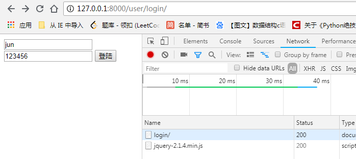

# token验证

on_delete=None,               # 删除关联表中的数据时,当前表与其关联的field的行为
on_delete=models.CASCADE,     # 删除关联数据,与之关联也删除
on_delete=models.DO_NOTHING,  # 删除关联数据,什么也不做
on_delete=models.PROTECT,     # 删除关联数据,引发错误ProtectedError

on_delete=models.SET_NULL,    # 删除关联数据,与之关联的值设置为null（前提FK字段需要设置为可空,一对一同理）

on_delete=models.SET_DEFAULT, # 删除关联数据,与之关联的值设置为默认值（前提FK字段需要设置默认值,一对一同理）
on_delete=models.SET,         # 删除关联数据,
 a. 与之关联的值设置为指定值,设置：models.SET(值)

1.模型建立

```
class User(models.Model):
    username = models.CharField(unique=True,max_length=30)
    password = models.CharField(max_length=20)
    lastlogin = models.DateField(null=True,blank=True)

    class Meta:
        db_table = 'tb_myuser'

class UserToken(models.Model):
    """用户令牌"""
    token = models.CharField(max_length=32)
    user = models.OneToOneField('User', on_delete=models.CASCADE)
    class Meta:
        db_table = 'tb_token'
```

```

(djenv6) D:\python_three\workspace\django1\use_token>python manage.py  makemigrations
Migrations for 'user':
  user\migrations\0001_initial.py
    - Create model User
    - Create model UserToken

```

```
(djenv6) D:\python_three\workspace\django1\use_token>python manage.py  migrate
Operations to perform:
  Apply all migrations: admin, auth, contenttypes, sessions, user
Running migrations:
  Applying contenttypes.0001_initial... OK
  Applying auth.0001_initial... OK
  Applying admin.0001_initial... OK
  Applying admin.0002_logentry_remove_auto_add... OK
  Applying admin.0003_logentry_add_action_flag_choices... OK
  Applying contenttypes.0002_remove_content_type_name... OK
  Applying auth.0002_alter_permission_name_max_length... OK
  Applying auth.0003_alter_user_email_max_length... OK
  Applying auth.0004_alter_user_username_opts... OK
  Applying auth.0005_alter_user_last_login_null... OK
  Applying auth.0006_require_contenttypes_0002... OK
  Applying auth.0007_alter_validators_add_error_messages... OK
  Applying auth.0008_alter_user_username_max_length... OK
  Applying auth.0009_alter_user_last_name_max_length... OK
  Applying sessions.0001_initial... OK
  Applying user.0001_initial... OK

```


创建用户

```
(djenv6) D:\python_three\workspace\django1\use_token>python manage.py shell

Python 3.6.4 (v3.6.4:d48eceb, Dec 19 2017, 06:04:45) [MSC v.1900 32 bit (Intel)] on win32

Type "help", "copyright", "credits" or "license" for more information.

(InteractiveConsole)

>>> from user.tests import my_md5_hex
>>> from user.models import User, UserToken
>>> username = 'jun';password = my_md5_hex('123456')
>>> User.objects.create(username=username, password=password)
>>><User: User object (1)>


mysql> select * from tb_myuser;
+----+----------+----------------------------------+-----------+
| id | username | password                         | lastlogin |
+----+----------+----------------------------------+-----------+
|  1 | jun      | e10adc3949ba59abbe56e057f20f883e | NULL      |
+----+----------+----------------------------------+-----------+
1 row in set (0.00 sec)
```

结构


3.视图函数

```
def login(request):
    if request.method == "GET":
        return render(request, 'index.html')
    if request.method == "POST":
        status = {'code':100, 'message':'登陆成功'}
        username = request.POST['username']
        password = request.POST['password']
        password = my_md5_hex(password)
        user = User.objects.filter(username=username, password=password).first()
        if user:
            status['userid'] = request.session['userid'] = user.id
            with transaction.atomic():
                status['token'] = token = uuid1().hex
                UserToken.objects.update_or_create(user=user, defaults={'token': token})
                current_time = timezone.now()
                if user.lastlogin:
                    delta = current_time - user.lastlogin
                    if delta.days >= 1:
                        user.point += 5
                        user.lastlogin = current_time
                        user.save()
                else:
                    user.lastlogin = current_time
                    user.save()
        else:
            status['code'] = '30001'
            status['message'] = '用户名或密码错误'
        return JsonResponse(status)


def test(request):
    print(request.session["userid"])
    return render(request,"test.html")


def userToken(request):
    """token验证"""
    id = request.session['userid']
    accept_token = request.META.get("HTTP_AUTHORIZATION")
    token=UserToken.objects.filter(user=id).first().token
    if token == accept_token:
        return JsonResponse({"msg":"恭喜无需登陆直接进入"})
    return JsonResponse({"msg":"请登陆！！！"})
```


前端

```
<form id="login">
    
            <tr>
                    <input type="text" class="name" name="username">
            </tr>
           <tr>
                    <input type="text" class="pw" name="password">
            </tr>
    <input type="submit" id="form-login" value="登陆">
</form>
<script>
$(document).ready(function() {
      $("#login").submit(function(e){
        e.preventDefault();
        var name = $(".name").val();
        var pw = $(".pw").val();
        $.ajax({
            url:'/user/login/',
            type:'POST',
            dataType:'JSON',
            data:{'username':name,'password':pw,csrfmiddlewaretoken:'{{ csrf_token }}'},
            success:function(data){
                if(data.code == 100)
                {console.log('OK');
                localStorage["mytest"]=data.token;
                location = "/user/test/";
                }
            },
            error:function(data){
                console.log('错误！')
            }
        })
})
    });
</script>


<script>
$(document).ready(function() {
    var token = localStorage["mytest"];
    console.log(token);
    $.ajax({
    type: "GET",
    url: "/user/userToken/",
    dataType:'JSON',
    headers: {'Authorization': token},
    success: function(data){
        $("#main").text(data.msg);
    }
});
});
</script>
```




4.测试


