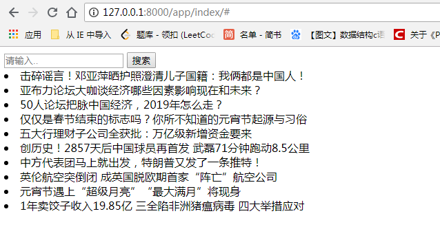
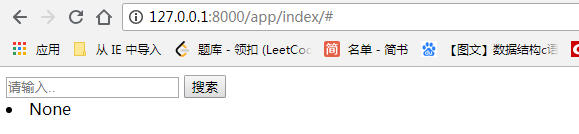
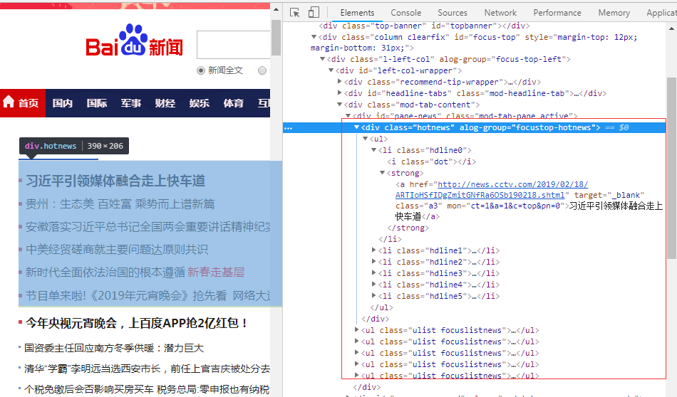
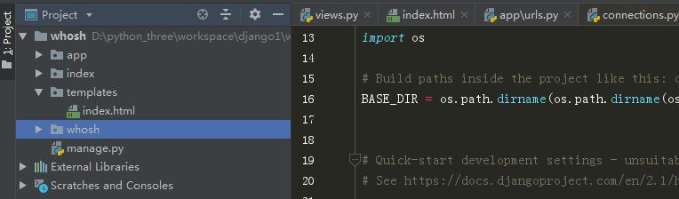

# whoosh全文检索

#### 使用whoosh实现一个简单的全文检索，在浏览器中实现通过关键字实现对新闻的检索

效果预览 

----

**搜索有结果的情况**



----

**搜索不到结果的情况**





* 首先通过爬虫从百度新闻获取一些数据
* 创建好MySQL数据库
* 通过Django搭建平台


**1.创建MySQL数据库**

这里笔者直接在阿里云进行操作

```
mysql> create database whosh default charset utf8;
Query OK, 1 row affected (0.09 sec)

mysql> create table news (
    -> id int,
    -> title varchar(1028),
    -> content TEXT,
    -> primary key(id)
    -> );
ERROR 1046 (3D000): No database selected
mysql> use whosh;
Database changed
mysql> create table news ( id int, title varchar(1028), content TEXT, primary key(id) );
Query OK, 0 rows affected (0.05 sec)

mysql> 
```

**2.从百度获取数据并使用Xpath解析：**


---





**新建mysqldb.py文件封装操作MySQL的方法**

```
import pymysql

def get_con():
	host = '47.106.211.81'
	port = 3308
	user = 'root'
	password = 'your password'
	database = 'whosh'
	db = pymysql.connect(host=host,user=user,password=password,database=database,charset='utf8',port=port)
	return db

def insert(db,cursor,item):
	cursor.execute(query='insert into news(title,content) values (%s,%s)',args=(item['title'],item['content']))
	# print(db)
	db.commit()

def close(db):

	db.close()
```

**新建get_news.py文件用来获取和保存数据**

```

import requests
from lxml import etree
from mysqldb import *

db = get_con()
cursor = db.cursor()


def parse_content(url):
	"""解析内容"""
	res = requests.get(url)
	if res.status_code==200:
		html = res.content.decode('utf-8')
		print(html)
		con = etree.HTML(html)
		content_list = con.xpath('//div[@class="article-content"]//span[@class="bjh-p"]//text()')
		content = ''
		for value in content_list:
			content += value.strip('')
		return content


def get():
    """获取新闻"""
    
    url = 'http://news.baidu.com/'
    res = requests.get(url)
    if res.status_code==200:
        html = res.content.decode('utf-8')
        con = etree.HTML(html)
        results = con.xpath('//div[@id="pane-news"]//ul[@class="ulist focuslistnews"]')
    for result in results:
        lis = result.xpath('.//a')
        for li in lis:
        	item = {}
        	title = li.xpath('./text()')[0]
        	href = li.xpath('./@href')[0]
        	content = parse_content(href)
        	item['title'] = title
        	item['content'] = content
        	insert(db,cursor,item)

if __name__ == '__main__':
		get()
```


**5.新建一个Django项目**



* 主要是编写视图函数和前端页面，这里就只介绍这两部分

---


**6.视图函数编写**

```
from django.shortcuts import render
from whoosh.qparser import QueryParser
from whoosh.index import create_in
from whoosh.index import open_dir
from whoosh.fields import TEXT, ID, Schema
from jieba.analyse import ChineseAnalyzer
from app.models import News

def index_create(request):
	"""索引创建"""
	
    analyser = ChineseAnalyzer()  # 导入中文分词工具
    """
    使用whoosh首先要建立schema对象，第一次创建索引时，必须定义索引的模式。该模式列出了索引中的字段。
    字段是索引中每个文档的一条信息，例如其标题或文本内容。
    下面使用到的schema索引对象。
    whoosh.fields.ID:这种类型只是将字段的整个值索引（并可选地存储）为一个单元（也就是说，它不会将其分解为单个单词）。这对于文件路径，URL，日期，类别等字段很有用。
    
    whoosh.fields.STORED:此字段与文档一起存储，但未编入索引。此字段类型未编入索引且无法搜索。
                         这对于要在搜索结果中向用户显示的文档信息很有用。
                         
    whoosh.fields.TEXT:此类型用于正文。它索引（并可选地存储）文本并存储术语位置以允许短语搜索。
    """
    schema = Schema(title=TEXT(stored=True, analyzer=analyser),
                    content=TEXT(analyzer=analyser))  # 创建索引结构

    ix = create_in("index", schema=schema, indexname='index')  # test为索引创建的地址，indexname为索引名称
    writer = ix.writer()
    # 读取文件内容
    datas = News.objects.all()
    for data in datas:
        news_title = data.title
        news_content = data.content
        writer.add_document(title=news_title,content=news_content)
    writer.commit()

def index(request):
	"""搜索"""
	
    if request.method == "GET":
        return render(request, 'index.html')

    if request.method == "POST":
        data = request.POST.get('sea')
        if data:
            new_dict = [] # 存储检索结果
            code = ''
            index = open_dir("index", indexname='index')  # 读取建立好的索引
            with index.searcher() as searcher:
                parser = QueryParser("content", index.schema)  # 生成查询字段的对象
                find = input("请输入检索内容：")  # find表示要查询的内容
                myquery = parser.parse(find)  # 在content字段查询
                
                results = searcher.search(myquery) # 搜索结果
                for result1 in results:
                    code = 200
                    new_dict.append(dict(result1))
                if not new_dict:
                    code = 100
            return render(request,'index.html',{'content': new_dict})
```

**7.前端页面实现**


```
<!DOCTYPE html>
<html lang="en">
<head>
    <meta charset="UTF-8">
    <title>whoosh</title>
</head>
<body>
    <form action='' method="post">
        
        <div class='form1'>
            <span class='search'></span>
            <input  class='inpu1'name="sea" type='text' placeholder='请输入..'/>
            <input class='bu1' value='搜索' type='submit'/>
        </div>
        
            
            <li>{{i.title}}</li>
            
        
            <li>None</li>
        
    </form>
</body>
</html>
```

**8.效果**


